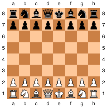

# portfolio-project

**Remember that this project cannot be submitted late.**

Write a class named **ChessVar** for playing an abstract board game that is a variant of chess. The following explanation of the rules assumes some familiarity with the rules of chess - specifically how the pieces move and capture. If you have any questions about those rules, please don't hesitate to ask.

The starting position for the game is the normal starting position for standard chess.

You will need to keep track of which player's turn it is. As in standard chess, white moves first. **The winner is the first player to capture all of an opponent's pieces of one type**, for example capturing all of the opponent's knights (of which there are two) would win the game, or all of the opponent's pawns (of which there are eight), or all of the opponent's kings (of which there is only one), etc. The king isn't a special piece in this game - there is no check or checkmate. Pieces move and capture the same as in standard chess, except that there is no castling, en passant, or pawn promotion. As in standard chess, each pawn should be able to move two spaces forward on its first move (but not on subsequent moves).

Locations on the board will be specified using "algebraic notation", with columns labeled a-h and rows labeled 1-8, as shown in this diagram:



You're not required to have a function that prints the board, but you will probably find it very useful for testing purposes.

Your ChessVar class must include the following:
* An **init method** that initializes any data members
* A method called **get_game_state** that just returns 'UNFINISHED', 'WHITE_WON', or 'BLACK_WON'.
* A method called **make_move** that takes two parameters - strings that represent the square moved from and the square moved to.  For example, make_move('b3', 'c4').  If the square being moved from does not contain a piece belonging to the player whose turn it is, or if the indicated move is not legal, or if the game has already been won, then it should **just return False**.  Otherwise it should make the indicated move, remove any captured piece, update the game state if necessary, update whose turn it is, and return True.

Feel free to add whatever other classes, methods, or data members you want.  All data members of a class must be private.  Every class should have an init method that initializes all of the data members for that class.

For representing the game board, there are other options, but the simplest choice might be to use an 8x8 list of lists (a list of 8 elements, where each of those elements is itself a list of 8 elements). Then you could access a specific square of the board like this: game_board[3][0].

Here's a very simple example of how the class could be used:
```
game = ChessVar()
move_result = game.make_move('a2', 'a4')
game.make_move('g1', 'f1')
state = game.get_game_state()
```
The file must be named: **ChessVar.py**
